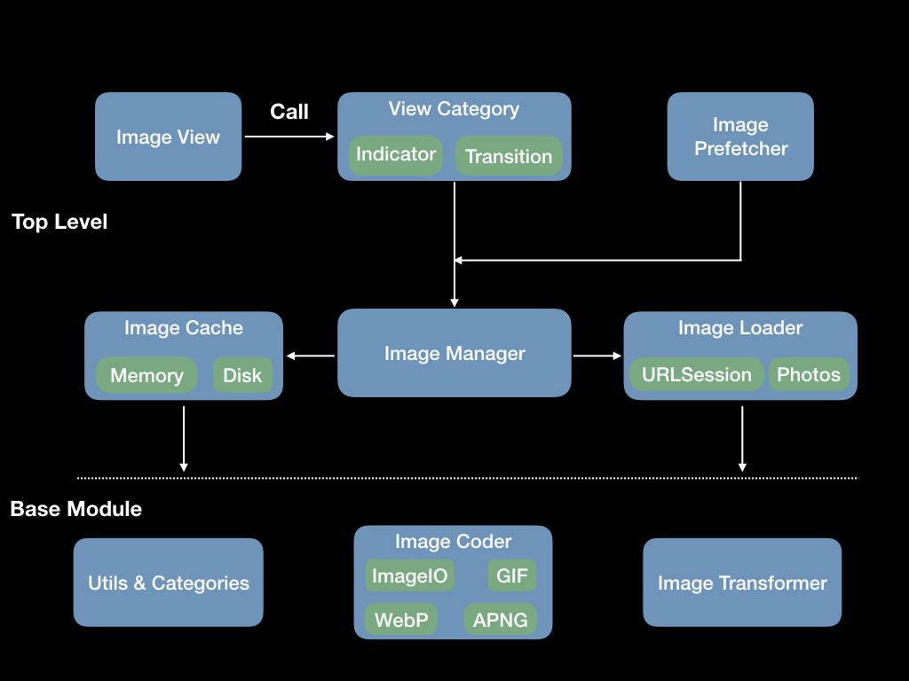
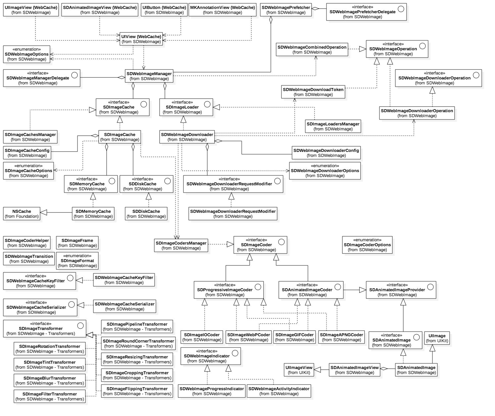
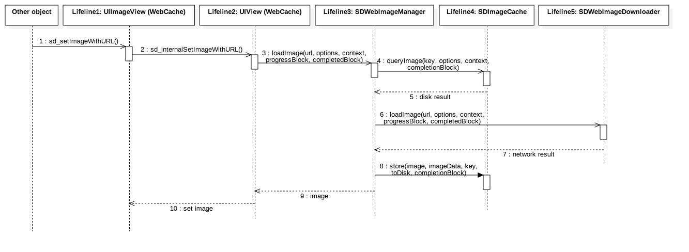

<p align="center" >
  
</p>


[](https://travis-ci.org/rs/SDWebImage)
[](http://cocoadocs.org/docsets/SDWebImage/)
[](http://cocoadocs.org/docsets/SDWebImage/)
[](https://www.apache.org/licenses/LICENSE-2.0.html)
[](https://github.com/rs/SDWebImage)
[](https://codecov.io/gh/rs/SDWebImage)

This library provides an async image downloader with cache support. For convenience, we added categories for UI elements like `UIImageView`, `UIButton`, `MKAnnotationView`.

## Features

- [x] Categories for `UIImageView`, `UIButton`, `MKAnnotationView` adding web image and cache management
- [x] An asynchronous image downloader
- [x] An asynchronous memory + disk image caching with automatic cache expiration handling
- [x] A background image decompression
- [x] Improved [support for animated images](https://github.com/rs/SDWebImage/wiki/Advanced-Usage#animated-image-50)
- [x] [Customizable and composable transformations](https://github.com/rs/SDWebImage/wiki/Advanced-Usage#transformer-50) can be applied to the images right after download
- [x] [Custom cache control](https://github.com/rs/SDWebImage/wiki/Advanced-Usage#custom-cache-50)
- [x] Expand the image loading capabilites by adding your [own custom loaders](https://github.com/rs/SDWebImage/wiki/Advanced-Usage#custom-loader-50) or using prebuilt loaders like [FLAnimatedImage plugin](https://github.com/SDWebImage/SDWebImageFLPlugin) or [Photos Library plugin](https://github.com/SDWebImage/SDWebImagePhotosPlugin)
- [x] [Loading indicators](https://github.com/rs/SDWebImage/wiki/How-to-use#use-view-indicator-50)
- [x] A guarantee that the same URL won't be downloaded several times
- [x] A guarantee that bogus URLs won't be retried again and again
- [x] A guarantee that main thread will never be blocked
- [x] Performances!
- [x] Use GCD and ARC

## Supported Image Formats

- Image formats supported by UIImage (JPEG, PNG, ...), including GIF
- WebP format, including animated WebP (use the `WebP` subspec)

## Requirements

- iOS 8.0 or later
- tvOS 9.0 or later
- watchOS 2.0 or later
- macOS 10.10 or later
- Xcode 9.0 or later

#### Backwards compatibility

- For iOS 7, macOS 10.9 or Xcode < 8, use [any 4.x version up to 4.3.3](https://github.com/rs/SDWebImage/releases/tag/4.3.3)
- For macOS 10.8, use [any 4.x version up to 4.3.0](https://github.com/rs/SDWebImage/releases/tag/4.3.0)
- For iOS 5 and 6, use [any 3.x version up to 3.7.6](https://github.com/rs/SDWebImage/tag/3.7.6)
- For iOS < 5.0, please use the last [2.0 version](https://github.com/rs/SDWebImage/tree/2.0-compat).

## Getting Started

- Read this Readme doc
- Read the [How to use section](https://github.com/rs/SDWebImage#how-to-use)
- Read the [Documentation @ CocoaDocs](http://cocoadocs.org/docsets/SDWebImage/)
- Try the example by downloading the project from Github or even easier using CocoaPods try `pod try SDWebImage`
- Read the [Installation Guide](https://github.com/rs/SDWebImage/wiki/Installation-Guide)
- Read the [SDWebImage 5.0 Migration Guide](Docs/SDWebImage-5.0-Migration-guide.md) to get an idea of the changes from 4.x to 5.x
- Read the [SDWebImage 4.0 Migration Guide](Docs/SDWebImage-4.0-Migration-guide.md) to get an idea of the changes from 3.x to 4.x
- Read the [Common Problems](https://github.com/rs/SDWebImage/wiki/Common-Problems) to find the solution for common problems 
- Go to the [Wiki Page](https://github.com/rs/SDWebImage/wiki) for more information such as [Advanced Usage](https://github.com/rs/SDWebImage/wiki/Advanced-Usage)

## Who Uses It
- Find out [who uses SDWebImage](https://github.com/rs/SDWebImage/wiki/Who-Uses-SDWebImage) and add your app to the list.

## Communication

- If you **need help**, use [Stack Overflow](http://stackoverflow.com/questions/tagged/sdwebimage). (Tag 'sdwebimage')
- If you'd like to **ask a general question**, use [Stack Overflow](http://stackoverflow.com/questions/tagged/sdwebimage).
- If you **found a bug**, open an issue.
- If you **have a feature request**, open an issue.
- If you **want to contribute**, submit a pull request.

## How To Use

* Objective-C

```objective-c
#import <SDWebImage/UIImageView+WebCache.h>
...
[imageView sd_setImageWithURL:[NSURL URLWithString:@"http://www.domain.com/path/to/image.jpg"]
             placeholderImage:[UIImage imageNamed:@"placeholder.png"]];
```

* Swift

```swift
import SDWebImage

imageView.sd_setImage(with: URL(string: "http://www.domain.com/path/to/image.jpg"), placeholderImage: UIImage(named: "placeholder.png"))
```

- For details about how to use the library and clear examples, see [The detailed How to use](Docs/HowToUse.md)

## Animated Images (GIF) support

In 5.0, we introduced a brand new mechanism for supporting animated images. This includes animated image loading, rendering, decoding, and also supports customizations (for advanced users).
This animated image solution is available for `iOS`/`tvOS`/`macOS`. The `SDAnimatedImage` is subclass of `UIImage/NSImage`, and `SDAnimatedImageView` is subclass of `UIImageView/NSImageView`, to make them compatible with the common frameworks APIs. See [Animated Image](https://github.com/rs/SDWebImage/wiki/Advanced-Usage#animated-image-50) for more detailed information.

#### FLAnimatedImage integration has its own dedicated repo
In order to clean up things and make our core project do less things, we decided that the `FLAnimatedImage` integration does not belong here. From 5.0, this will still be available, but under a dedicated repo [SDWebImageFLPlugin](https://github.com/SDWebImage/SDWebImageFLPlugin).

## Installation

There are three ways to use SDWebImage in your project:
- using CocoaPods
- using Carthage
- by cloning the project into your repository

### Installation with CocoaPods

[CocoaPods](http://cocoapods.org/) is a dependency manager for Objective-C, which automates and simplifies the process of using 3rd-party libraries in your projects. See the [Get Started](http://cocoapods.org/#get_started) section for more details.

#### Podfile
```
platform :ios, '7.0'
pod 'SDWebImage', '~> 4.0'
```

If you are using Swift, be sure to add `use_frameworks!` and set your target to iOS 8+:
```
platform :ios, '8.0'
use_frameworks!
```

#### Subspecs

There are 3 subspecs available now: `Core`, `MapKit` and `WebP` (this means you can install only some of the SDWebImage modules. By default, you get just `Core`, so if you need `WebP`, you need to specify it). 

Podfile example:
```
pod 'SDWebImage/WebP'
```

### Installation with Carthage (iOS 8+)

[Carthage](https://github.com/Carthage/Carthage) is a lightweight dependency manager for Swift and Objective-C. It leverages CocoaTouch modules and is less invasive than CocoaPods.

To install with carthage, follow the instruction on [Carthage](https://github.com/Carthage/Carthage)

#### Cartfile
```
github "rs/SDWebImage"
```

### Installation by cloning the repository
- see [Manual install](Docs/ManualInstallation.md)

### Import headers in your source files

In the source files where you need to use the library, import the header file:

```objective-c
#import <SDWebImage/UIImageView+WebCache.h>
```

### Build Project

At this point your workspace should build without error. If you are having problem, post to the Issue and the
community can help you solve it.

## Author
- [Olivier Poitrey](https://github.com/rs)

## Collaborators
- [Konstantinos K.](https://github.com/mythodeia)
- [Bogdan Poplauschi](https://github.com/bpoplauschi)
- [Chester Liu](https://github.com/skyline75489)
- [DreamPiggy](https://github.com/dreampiggy)
- [Wu Zhong](https://github.com/zhongwuzw)

## Licenses

All source code is licensed under the [MIT License](https://raw.github.com/rs/SDWebImage/master/LICENSE).

## Architecture

#### High Level Diagram
<p align="center" >
    
</p>

#### Overall Class Diagram
<p align="center" >
    
</p>

#### Top Level API Diagram
<p align="center" >
    
</p>

#### Main Sequence Diagram
<p align="center" >
    
</p>

#### More detailed diagrams
- [Manager API Diagram](Docs/Diagrams/SDWebImageManagerClassDiagram.png)
- [Coders API Diagram](Docs/Diagrams/SDWebImageCodersClassDiagram.png)
- [Loader API Diagram](Docs/Diagrams/SDWebImageLoaderClassDiagram.png)
- [Cache API Diagram](Docs/Diagrams/SDWebImageCacheClassDiagram.png)