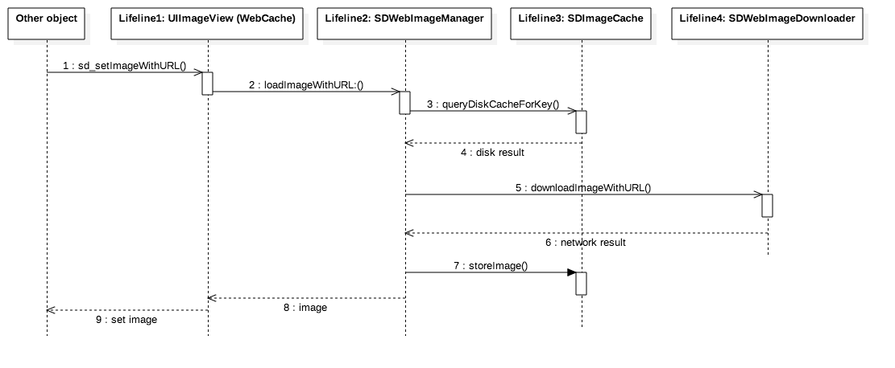

<p align="center">
  
</p>


[](https://travis-ci.org/SDWebImage/SDWebImage)
[](http://cocoadocs.org/docsets/SDWebImage/)
[](http://cocoadocs.org/docsets/SDWebImage/)
[](https://www.apache.org/licenses/LICENSE-2.0.html)
[](https://github.com/SDWebImage/SDWebImage)
[](https://codecov.io/gh/SDWebImage/SDWebImage)

This library provides an async image downloader with cache support. For convenience, we added categories for UI elements like `UIImageView`, `UIButton`, `MKAnnotationView`.

## Features

- [x] Categories for `UIImageView`, `UIButton`, `MKAnnotationView` adding web image and cache management
- [x] An asynchronous image downloader
- [x] An asynchronous memory + disk image caching with automatic cache expiration handling
- [x] A background image decompression
- [x] A guarantee that the same URL won't be downloaded several times
- [x] A guarantee that bogus URLs won't be retried again and again
- [x] A guarantee that main thread will never be blocked
- [x] Performances!
- [x] Use GCD and ARC

## Supported Image Formats

- Image formats supported by UIImage (JPEG, PNG, ...), including GIF
- WebP format, including animated WebP (use the `WebP` subspec)

## Requirements

- iOS 7.0 or later
- tvOS 9.0 or later
- watchOS 2.0 or later
- macOS 10.9 or later
- Xcode 7.3 or later

#### Backwards compatibility

- For iOS 5 and 6, use [any 3.x version up to 3.7.6](https://github.com/SDWebImage/SDWebImage/tree/3.7.6)
- For iOS < 5.0, please use the last [2.0 version](https://github.com/SDWebImage/SDWebImage/tree/2.0-compat).

## Getting Started

- Read this Readme doc
- Read the [How to use section](https://github.com/SDWebImage/SDWebImage#how-to-use)
- Read the [Documentation @ CocoaDocs](http://cocoadocs.org/docsets/SDWebImage/)
- Try the example by downloading the project from Github or even easier using CocoaPods try `pod try SDWebImage`
- Read the [Installation Guide](https://github.com/SDWebImage/SDWebImage/wiki/Installation-Guide)
- Read the [SDWebImage 4.0 Migration Guide](Docs/SDWebImage-4.0-Migration-guide.md) to get an idea of the changes from 3.x to 4.x
- Read the [Common Problems](https://github.com/SDWebImage/SDWebImage/wiki/Common-Problems) to find the solution for common problems 
- Go to the [Wiki Page](https://github.com/SDWebImage/SDWebImage/wiki) for more information such as [Advanced Usage](https://github.com/SDWebImage/SDWebImage/wiki/Advanced-Usage)

## Who Uses It
- Find out [who uses SDWebImage](https://github.com/SDWebImage/SDWebImage/wiki/Who-Uses-SDWebImage) and add your app to the list.

## Communication

- If you **need help**, use [Stack Overflow](http://stackoverflow.com/questions/tagged/sdwebimage). (Tag 'sdwebimage')
- If you'd like to **ask a general question**, use [Stack Overflow](http://stackoverflow.com/questions/tagged/sdwebimage).
- If you **found a bug**, open an issue.
- If you **have a feature request**, open an issue.
- If you **want to contribute**, submit a pull request.

## How To Use

* Objective-C

```objective-c
#import <SDWebImage/UIImageView+WebCache.h>
...
[imageView sd_setImageWithURL:[NSURL URLWithString:@"http://www.domain.com/path/to/image.jpg"]
             placeholderImage:[UIImage imageNamed:@"placeholder.png"]];
```

* Swift

```swift
import SDWebImage

imageView.sd_setImage(with: URL(string: "http://www.domain.com/path/to/image.jpg"), placeholderImage: UIImage(named: "placeholder.png"))
```

- For details about how to use the library and clear examples, see [The detailed How to use](Docs/HowToUse.md)

## Animated Images (GIF) support

- Starting with the 4.0 version, we rely on [FLAnimatedImage](https://github.com/Flipboard/FLAnimatedImage) to take care of our animated images. 
- If you use cocoapods, add `pod 'SDWebImage/GIF'` to your podfile.
- To use it, simply make sure you use `FLAnimatedImageView` instead of `UIImageView`.
- **Note**: there is a backwards compatible feature, so if you are still trying to load a GIF into a `UIImageView`, it will only show the 1st frame as a static image by default. However, you can enable the full GIF support by using the built-in GIF coder. See [GIF coder](https://github.com/SDWebImage/SDWebImage/wiki/Advanced-Usage#gif-coder)
- **Important**: FLAnimatedImage only works on the iOS platform. For macOS, use `NSImageView` with `animates` set to `YES` to show the entire animated images and `NO` to only show the 1st frame. For all the other platforms (tvOS, watchOS) we will fallback to the backwards compatibility feature described above 

## Installation

There are three ways to use SDWebImage in your project:
- using CocoaPods
- using Carthage
- by cloning the project into your repository

### Installation with CocoaPods

[CocoaPods](http://cocoapods.org/) is a dependency manager for Objective-C, which automates and simplifies the process of using 3rd-party libraries in your projects. See the [Get Started](http://cocoapods.org/#get_started) section for more details.

#### Podfile
```
platform :ios, '7.0'
pod 'SDWebImage', '~> 4.0'
```

If you are using Swift, be sure to add `use_frameworks!` and set your target to iOS 8+:
```
platform :ios, '8.0'
use_frameworks!
```

#### Subspecs

There are 4 subspecs available now: `Core`, `MapKit`, `GIF` and `WebP` (this means you can install only some of the SDWebImage modules. By default, you get just `Core`, so if you need `WebP`, you need to specify it). 

Podfile example:
```
pod 'SDWebImage/WebP'
```

### Installation with Carthage (iOS 8+)

[Carthage](https://github.com/Carthage/Carthage) is a lightweight dependency manager for Swift and Objective-C. It leverages CocoaTouch modules and is less invasive than CocoaPods.

To install with carthage, follow the instruction on [Carthage](https://github.com/Carthage/Carthage)

#### Cartfile
```
github "SDWebImage/SDWebImage"
```

### Installation by cloning the repository
- see [Manual install](Docs/ManualInstallation.md)

### Import headers in your source files

In the source files where you need to use the library, import the header file:

```objective-c
#import <SDWebImage/UIImageView+WebCache.h>
```

### Build Project

At this point your workspace should build without error. If you are having problem, post to the Issue and the
community can help you solve it.

## Author
- [Olivier Poitrey](https://github.com/rs)

## Collaborators
- [Konstantinos K.](https://github.com/mythodeia)
- [Bogdan Poplauschi](https://github.com/bpoplauschi)
- [Chester Liu](https://github.com/skyline75489)
- [DreamPiggy](https://github.com/dreampiggy)
- [Wu Zhong](https://github.com/zhongwuzw)

## Licenses

All source code is licensed under the [MIT License](https://raw.github.com/SDWebImage/SDWebImage/master/LICENSE).

## Architecture

<p align="center">
    
</p>

<p align="center">
    
</p>
